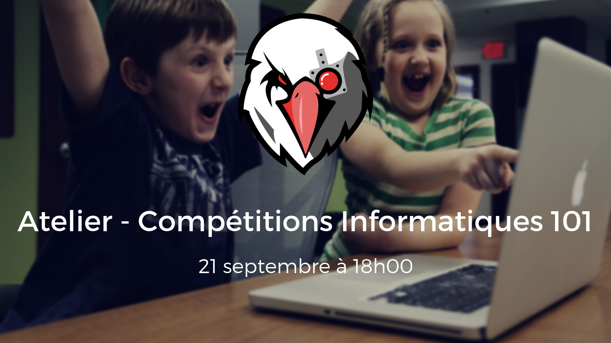

# Compétitions Informatiques 101

> 21 septembre 2018

## Présentation

[Présentation](./presentation.pdf)

## Challenges

Les solutions sont se trouve dans le fichier `README.md` du dossier de chaque challenge.

- [programming](./challenges/programming)
- [reverse-asm](./challenges/reverse-asm)
- [reverse-mobile](./challenges/reverse-mobile)
- [web-level-1](./challenges/web-level-1)
- [web-level-2](./challenges/web-level-2)
